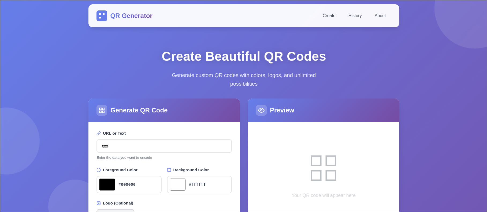

<p align="center">
  
</p>

<h1 align="center">🔳 QR Code Generator</h1>

<p align="center">
  A modern and customizable QR Code Generator built with Flask.
</p>

<p align="center">
  
  
  
  
  
</p>

---

## ✨ Features

- 🎨 Custom foreground & background colors  
- 🖼️ Optional center logo upload  
- 💾 QR code history saved locally  
- ⚡ Live preview with JavaScript  
- 📱 Responsive modern interface  

---

## 🚀 Installation

```bash
git clone https://github.com/Senpai7Adim/QRcode.git
cd QRcode
pip install -r requirements.txt
python app.py
```


## 📸 Preview
<p align="center">

</p>


